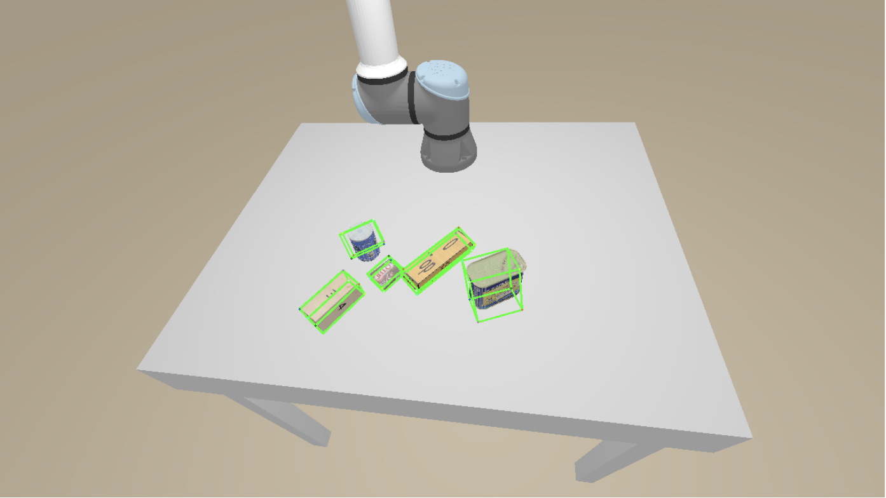

# ICP_Learning-based-6D-Pose-Estimation
Solve the 6D pose estimation with ICP-based(Umeyama with scale calculation) &amp; Learning-based(consider symmetry) methods.

## 1. ICP-based 6D Pose Esimation

Iterative closet points with Umeyama alignment.

### ICP results

### Improvement Suggestion

Use better Init transformation and Init scale methods.

## 2. Learning-based 6D Pose Estimation

- Direct approaches: predict rotation and translation directly
- Train a neural network: PointNet
- considering symmetry

### Learning-based results

